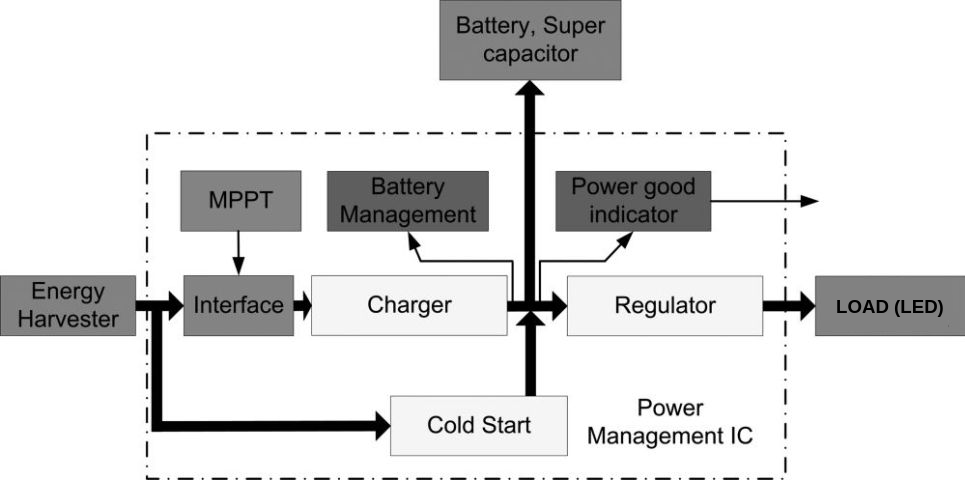
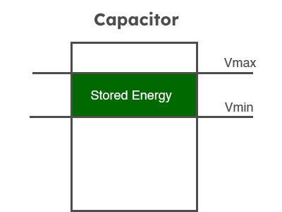
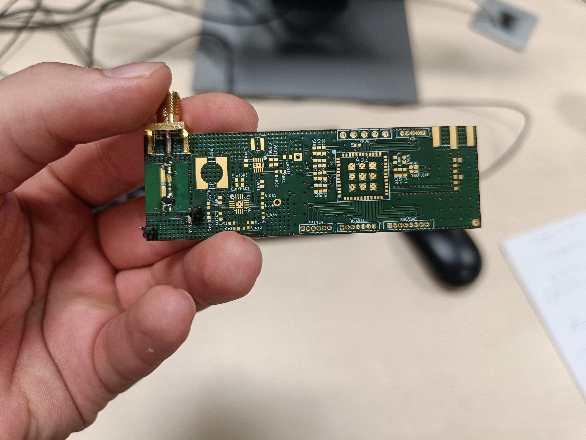
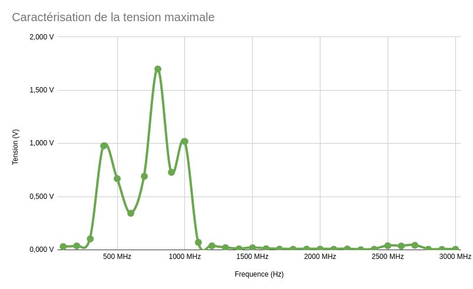
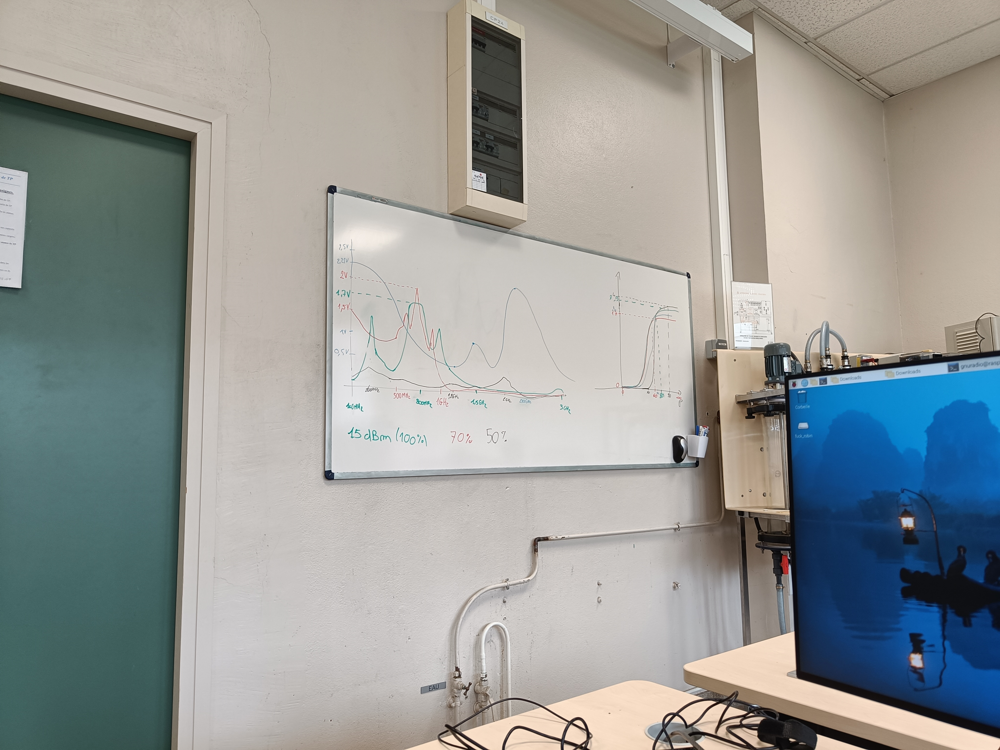
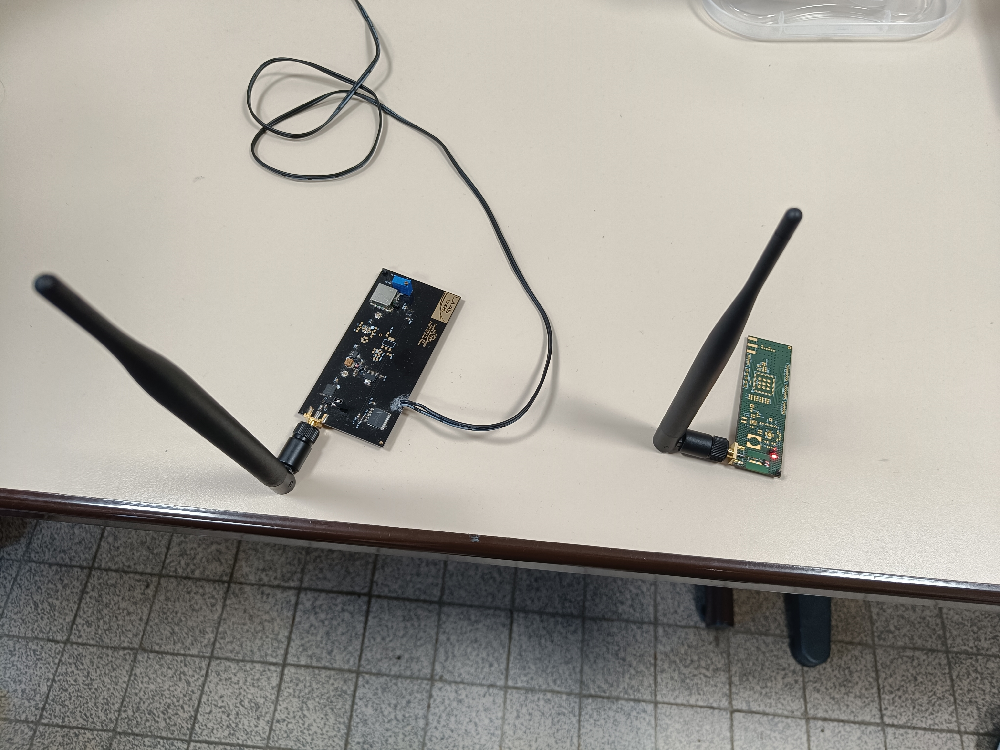

# Energy for Connected Objects

## Introduction

Remote and wireless transmission of power emerged with the invention of Tesla coils with Nikola Tesla. He wanted to make a near-field inductive and capacitive coupling to power numerous object with great distance. In 1901 New York attempted to create a large power delivery structure now called *Wardenclyffe Tower*. Its purpose was to deliver power to everyone wirelessely, unfortunately because the costs went out, in 1904 this idea was scrapped.

The development of Radio-communication during the WWII for military purposes helped the research around transferring data over waves. This technology took different path and shape, with the invention of the magnetron by *John Randall* and *Harry Boot*. This leads to the discovery of the microwave beam by *Percy Spencer*; when an object containing water is exposed in a powerful 2.4 GHz wave, its molecules start to move rapidly, hence, heat is created.

In 2024, we are submerged in dense waves: Wi-Fi, bluetooth, radio, television: this stream does not only contain data, but power too, that can in theory be harvested.

> The need for wireless power source came in 2014 when the robot Philae landed on the asteroid *"67P/Churyumov-Gerasimenko"*. After a bouncy landing, the robot was stuck in shadowed cliff, because it was solar-powered, Philae could not send any data for nearly 60 hours, waiting for the asteroid to face the sun.

Far-field energy distribution can be achieved using radiative (microwave/radio-frequency) or laser. Lasers are nowadays used, in an experimental way, for certain missions, it can be quite dangerous and need a line of sight that is precise. Radiative energy delivery on the other hand can be used in wider areas on earth and are less sensible to direction. Certain frequencies can be used and deliver power up to kilometers.

This could help countries that face unprecedented natural disasters cutting off power, by giving them a way to wirelessly gather power. We could harvest the power that is all around us with the correct technology too. This practical work is aimed towards these ideas, we need to power an LED using Wi-Fi or other frequencies. We will first focus on the power needed for such an application, then test it on a real hardware designed for it.

## Modeling the system

Using the following data sheets:
- [BQ25504](https://www.ti.com/lit/ds/symlink/bq25504.pdf) - Ultra Low-Power Boost Converter
- [TPS6303x](https://www.ti.com/lit/ds/symlink/tps63030.pdf) - Single Inductor Buck-Boost converter
- [SML-D12x1](https://www.tme.eu/Document/932347758f1894d9ef5e9a8053d7c609/SML-D12Y1WT86.pdf) - CMS Led 

### Led power

First, we need to specify how much DC power is required by the LED in its nominal use case. In the led's data sheet we can see in **Figure 3** the luminous intensity depending on the forwarded current as well as the voltage depending on the current in **Figure 1**.

*Figure 1: Forward Current - Forward Voltage*

*Figure 3: Luminous Intensity - Forward Current*

|Luminous intensity|Current|Power|
|:--|---|---|
|25%|5 mA|$5\times{10^{-3}}\times{1.9}=9.5mW$|
|50%|10 mA|$10\times{10^{-3}}\times{2}=20mW$|
|100%|20 mA|$5\times{10^{-3}}\times{2.2}=44mW$|

To make this led turn on for over a second it means that we require at least 44 mJ for 100% of its intensity, 20 mJ for 50% and 9.5 mJ for 25%. We are around the same unit in either of these configuration. Let's take for example the [*STM32C011x4/x6*](https://www.st.com/en/microcontrollers-microprocessors/stm32c011j4.html?icmp=tt40742_gl_lnkon_sep2024#sample-buy) which is a typical $\mu C$ used in many low power scenarios: let's take the run, sleep, stop and standby modes.

|Mode (Max)|Current consumption|Power (VDD = $3V$)|
|:--|--:|--:|
|Run mode|3.90 $mA$ *@ 48 MHz*|11.7 $mW$|
|Sleep mode|1.50 $mA$ *@ 48 MHz*|4.5 $mW$|
|Standby mode|8.2 $\mu A$|24.6 $\mu W$|
|Shutdown mode|72 $nA$|216 $nA$|

As we can see, even at 50% of its luminescence, the led's consumption is greater than the run mode of the $\mu C$. This shows that our test can even be used in more complex systems with multiple active components. However, we are going to focus on the threshold where the led starts working. It will be at a lower power, but it is still close to the use of some $\mu C$ that runs at lower frequencies.

The minimum intensity the Led can deliver cannot be read directly from the data sheet. It is not written anywhere. The *Figure 3*, showed earlier, has the lowest intensity around 5%: Because we cannot be sure if lower luminous intensity can work, this value will be used for our theory.

 |Luminous intensity|Current|Power|
|:--|---|---|
|5% (Theoretical min.)|1 mA|$1\times{10^{-3}}\times{1.75}=1.75mW$|

This is the minimal power we must provide to the diode to work. This value will be used for the rest of the document. This is close to the use of some $\mu C$ under really low-power circumstances.

### Capacitors and their impact on the system

After working on the feasibility of the system in terms of power, we then need to focus on how to store the energy we send to the system. Ideally we would like to store enough energy each time we send power wirelessly. Because the system can be a little under-powered, we can use an energy buffer system to power properly the LED.

We would like to first use a simple Power Management Unit, combined with a DC-DC Buck-Boost converter. A Super-capacitor will be used as the "battery" to store enough energy for the led to work. Unfortunately, this power-management system uses power too to be triggered. We then need to size the capacitance.

From the *BQ25504* and *TPS6303x* documentation we can see that both needs 16.62 $\mu W$ during cold start. We can then size the system with the intensity of the Led we want to provide *(either 44 mW, 20 mW or 9.5mW)*. There is a set of capacitors we can use for this use case which is the following:

|Capacitance|Loss|
|--:|--:|
|100 $\mu F$|26.25 $nW$|
|220 $\mu F$|26.25 $nW$|
|1.5 $mF$|413 $\mu W$|
|2.2 $mF$|606 $\mu W$|
|6.8 $mF$|52.5 $\mu W$|
|10 $mF$|289 $\mu W$|
|22 $mF$|26.25 $\mu W$|

With the help of the following formula (Energy from the given capacitance and its max voltage and min voltage) and a schema showing how a capacitor stores energy: 

$E=\frac{1}{2}\times{C}({V_{max}}^{2}-{V_{min}}^{2})$

$C=\frac{2E}{({V_{max}}^{2}-{V_{min}}^{2})}$

$V_{max}=\sqrt{\frac{2E}{C}\times{V_{min}}^{2}}$

With the help of the schema we can argue that we want a minimal **Vmin** possible. It would allow the capacitance to begin conducting current as soon as possible. Has we saw earlier, the **Vmin** we would like is _2.2 V_, which corresponds to the LED being powered at 100% of its luminance. The Energy we want is, by logic, _44 mJ_. We can then test all the values of the capacitors and check when the **Vmax** is the maximum possible too *(we want to store the more energy possible)* while keeping it under **5.25 V** which is the maximum voltage the _BQ25504_ can operate. The final value we want to check would be the loss inherited from these capacitors, we want the minimum possible, these values depends entirely on the technology, and not the capacitance.

|Capacitance|$V_{max}$|Loss|
|--:|--:|--:|
|2.2 $mF$|6.69 V|606 $\mu W$|
|6.8 $mF$|4.22 V|52.5 $\mu W$|
|10 $mF$|3.69 V|289 $\mu W$|
|22 $mF$|2.97 V|26.25 $\mu W$|

From this table we can argue that we have the choice between the 6.8 mF, 10 mF and 22 mF. It is inevitably the **6.8 mF** capacitance from AVX, because it combines both the maximum **Vmax** possible _(minimal capacitance)_ and the minimal loss. From that we can calculate the minimal power required for such an application:

$P=Loss+Cold_{start}$

$52.5+16.62=69.12 \mu W$

### Choosing the right frequency

Between the given antennas which are **2.45 GHz** and **868 MHz**, the higher the frequency, the smaller the antenna would be. But the lower the frequency, the higher the propagation. Logically, we would want to have the lowest frequency because it would be better in terms of yield.

There are other technologies we can add to amplify the signal of any given frequency. For example a **868 MHz** transceiver may take the form of a patch, which gives the signal +9 dBi because of its shape which resonates at the same frequency and the directionality it gives (specific direction tends to nor spread the energy, and focus on a given point). For a **2.45 GHz** we tend to use a horn: it has a directive antenna, with a radiation pattern that focuses even more the antenna and low loss, it can add up to 11 dBi.

We use these technologies because the wavelength of both frequencies are different, a patch can work for lower frequencies, whereas horn are more well-fitted for higher frequencies (but lower wave-length).

### Link with our project

Our project is a leak detection in the water pipes. We can get multiple sources of energy coming from simple water pipes. First off the water flow can be a source of energy, but it requires to cut off the pipes to put a system like that. The other solution would be heating, when the user is using hot water, the difference in temperature can be gathered to power the device.

## Testing the system

### Software used

We are going to use the software called **GNURadio** which, connected to a proper device (an **Analog Discovery 2** in our case), can change its output values. Using nodes we are going to link the power to a slider, and we are going to do the same with the frequency. Afterwards, we are going to connect this output to our receiver with an LED.

Our first test consists of putting the maximum power to the output at a certain frequency, to check where the receiver is the most efficient. For that we are going to swipe some values and make a graph.

In our case, the maximum power we get is around 720 MHz to 920 MHz. It cannot be seen clearly in the graph, but it is in a reality a plato that extends up to 100 MHz, which gives us a wide scope. We can see that there are some resonating frequencies around 400 MHz and 1200 MHz which gives us some energy too. We can then compare our result to the rest of the class.

The rest of the class has given completely different behaviors. For the other group with a 868 MHz receiver, it is more compacted to a single value around 800 MHz. For the 2.45 GHz groups, we can see the same happening: in blue there is a plato, and in black, it is fixed to around 2 GHz (the scale is not the same because they did not use the same power).

Another test we led, was the power efficiency, some receiver, can output the same power for 15 dBm or 5 dBm. This analysis can be used to check how little energy we can transfer without any loss. From the results given by the class we know that between **60%** and **90%** of the maximum power delivered by the **Analog Discovery 2** we get the same output power from the card. This is of course because of the super-capacitor that lets power when it is sufficiently charged.

We can see that it works perfectly as intended. We got some different distance for each card. Ours could be up to **1 meter** until the led is visible.

## Conclusion

To conclude this project. We saw that there are multiple ways to send energy wirelessly, it can be with Wi-Fi, bluetooth, LoRa. Some energy can be harvested directly in the air to power many devices. However this comes with a strong limitation: the power delivered by Wi-Fi antennas or some LTE devices is not strong enough to deliver the sufficient power. We sometimes need to be so close to the router, that it begs the question: "Why doing it wirelessly, if we need to be close ?".

This is only a proof of concept for now, and we can imagine that with future radio frequencies, we could maybe use this power. For now it can be quite a loss and even if it requires little and cheap components, powering the device directly or harvesting resources near the device could be a better way to gather power.

## Sources

- https://teslasciencecenter.org/history/tower/
- [Scientists demonstrate wireless power transmission from space to Earth for first time](https://www.independent.co.uk/space/space-earth-wireless-power-beamed-b2353588.html) by **Vishwam Sankaran** on **Independent UK**
- [Rosetta: Battery will limit life of Philae comet lander](https://www.bbc.com/news/science-environment-30034060) by **Jonathan Amos** on **BBC News**
