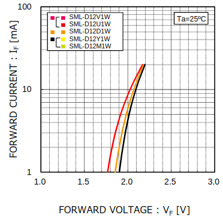
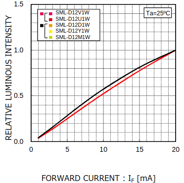

# Energy for Connected Objects

## Introduction

Remote and wireless transmission of power emerged with the invention of Tesla coils with Nikola Tesla. He wanted to make a near-field inductive and capacitive coupling to power numerous object with great distance. In 1901 New York attempted to create a large power delivery structure now called *Wardenclyffe Tower*. Its purpose was to deliver power to everyone wirelessely, unfortunately because the costs went out, in 1904 this idea was scrapped.

The development of Radio-communication during the WWII for military purposes helped the research around transferring data over waves. This technology took different path and shape, with the invention of the magnetron by *John Randall* and *Harry Boot*. This leads to the discovery of the microwave beam by *Percy Spencer*; when an object containing water is exposed in a powerful 2.4 GHz wave, its molecules start to move rapidly, hence, heat is created.

In 2024, we are submerged in dense waves: Wi-Fi, bluetooth, radio, television: this stream does not only contain data, but power too, that can in theory be harvested.

> The need for wireless power source came in 2014 when the robot Philae landed on the asteroid *"67P/Churyumov-Gerasimenko"*. After a bouncy landing, the robot was stuck in shadowed cliff, because it was solar-powered, Philae could not send any data for nearly 60 hours, waiting for the asteroid to face the sun.

Far-field energy distribution can be achieved using radiative (microwave/radio-frequency) or laser. Lasers are nowadays used, in an experimental way, for certain missions, it can be quite dangerous and need a line of sight that is precise. Radiative energy delivery on the other hand can be used in wider areas on earth and are less sensible to direction. Certain frequencies can be used and deliver power up to kilometers.

This could help countries that face unprecedented natural disasters cutting off power, by giving them a way to wirelessly gather power. We could harvest the power that is all around us with the correct technology too. This practical work is aimed towards these ideas, we need to power an LED using Wi-Fi or other frequencies. We will first focus on the power needed for such an application, then test it on a real hardware designed for it.

## Modeling the system

Using the following data sheets:
- [BQ25504](https://www.ti.com/lit/ds/symlink/bq25504.pdf) - Ultra Low-Power Boost Converter
- [TPS6303x](https://www.ti.com/lit/ds/symlink/tps63030.pdf) - Single Inductor Buck-Boost converter
- [SML-D12x1](https://www.tme.eu/Document/932347758f1894d9ef5e9a8053d7c609/SML-D12Y1WT86.pdf) - CMS Led 

### Led power

First, we need to specify how much DC power is required by the LED in its nominal use case. In the led's data sheet we can see in **Figure 3** the luminous intensity depending on the forwarded current as well as the voltage depending on the current in **Figure 1**.

*Figure 1: Forward Current - Forward Voltage*

*Figure 3: Luminous Intensity - Forward Current*

|Luminous intensity|Current|Power|
|:--|---|---|
|25%|5 mA|$5\times{10^{-3}}\times{1.9}=9.5mW$|
|50%|10 mA|$10\times{10^{-3}}\times{2}=20mW$|
|100%|20 mA|$5\times{10^{-3}}\times{2.2}=44mW$|

To make this led turn on for over a second it means that we require at least 44 mJ for 100% of its intensity, 20 mJ for 50% and 9.5 mJ for 25%. We are around the same unit in either of these configuration. Let's take for example the [*STM32C011x4/x6*](https://www.st.com/en/microcontrollers-microprocessors/stm32c011j4.html?icmp=tt40742_gl_lnkon_sep2024#sample-buy) which is a typical $\mu C$ used in many low power scenarios: let's take the run, sleep, stop and standby modes.

|Mode (Max)|Current consumption|Power (VDD = $3V$)|
|:--|--:|--:|
|Run mode|3.90 $mA$ *@ $48 MHz$*|11.7 $mW$|
|Sleep mode|1.50 $mA$ *@ $48 MHz$*|4.5 $mW$|
|Standby mode|8.2 $\mu A$|24.6 $\mu W$|
|Shutdown mode|72 $nA$|216 $nA$|

As we can see, even at 50% of its luminescence, the led's consumption is greater than the run mode of the $\mu C$. This shows that our test can even be used in more complex systems with multiple active components. However, we are going to focus on the threshold where the led starts working. It will be at a lower power, but it is still close to the use of some $\mu C$ that runs at lower frequencies.

The minimum intensity the Led can deliver cannot be read directly from the data sheet. It is not written anywhere. The *Figure 3*, showed earlier, has the lowest intensity around 5%: Because we cannot be sure if lower luminous intensity can work, this value will be used for our theory.

 |Luminous intensity|Current|Power|
|:--|---|---|
|5% (Theoretical min.)|1 mA|$1\times{10^{-3}}\times{1.75}=1.75mW$|

This is the minimal power we must provide to the diode to work. This value will be used for the rest of the document. This is close to the use of some $\mu C$ under really low-power circumstances.

### Capacitors and their impact on the system

### Choosing the right frequency

## Testing the system

### Software used

### Results and analysis

## Conclusion

## Sources

- https://teslasciencecenter.org/history/tower/
- [Scientists demonstrate wireless power transmission from space to Earth for first time](https://www.independent.co.uk/space/space-earth-wireless-power-beamed-b2353588.html) by **Vishwam Sankaran** on **Independent UK**
- [Rosetta: Battery will limit life of Philae comet lander](https://www.bbc.com/news/science-environment-30034060) by **Jonathan Amos** on **BBC News**
